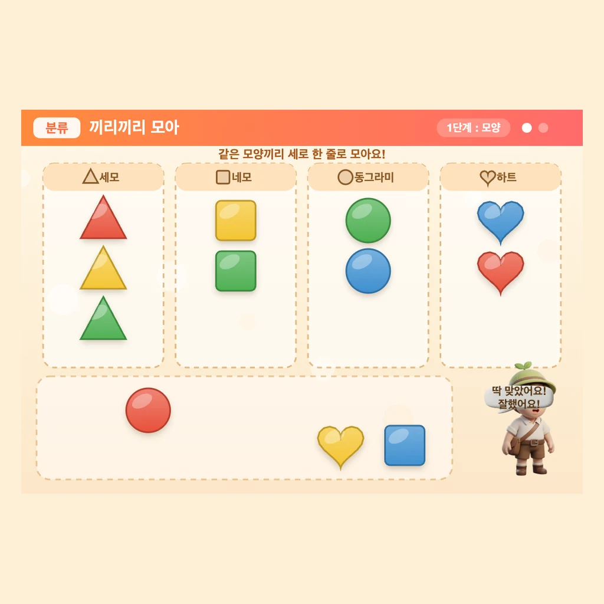

# 끼리끼리 모아 (kkiri-moa)

> EBS 「수학이 야호」 기반의 **분류(classification) 학습 교구** — 사물을 모양 · 색깔 · 크기로 끼리끼리 모으며 수학적 사고를 익히는 유아용 인터랙티브 웹 앱

<p align="center">
  
</p>

---

## 📖 소개

**끼리끼리 모아**는 EBS 「수학이 야호」의 동명 코너에서 착안한 분류 학습 교구입니다.
유아가 화면 속 사물을 직접 끌어다 옮기며, **같은 속성을 가진 것끼리 모으는(분류) 경험**을 놀이로 체득하도록 설계했습니다.

핵심 학습 포인트는 **"같은 사물도 기준을 바꾸면 다르게 묶인다"** 입니다.
동일한 오브젝트 묶음을 1단계에서는 **모양**으로, 2단계에서는 **색깔**로 다시 분류하면서 기준에 따른 분류의 차이를 자연스럽게 경험하고, 3단계에서는 **크기**라는 또 다른 기준으로 확장합니다.

- **대상**: 유아 ~ 초등 저학년
- **상호작용**: 드래그 & 드롭으로 같은 것끼리 세로 칼럼(줄)에 모으기
- **렌더링**: HTML5 Canvas 기반의 1024×700 화면, 반응형 스케일링 지원

> 기획 배경과 콘텐츠 설계 상세는 [`kkiri-moa-기획안.md`](kkiri-moa-기획안.md) 문서를 참고하세요.

---

## ✨ 주요 기능

- **3단계 분류 학습 (구현 완료)**
  | 단계 | 분류 기준 | 칼럼 |
  |---|---|---|
  | 1단계 | **모양** | 세모 · 네모 · 동그라미 · 별 |
  | 2단계 | **색깔** | 빨강 · 노랑 · 초록 · 파랑 |
  | 3단계 | **크기** | 별나라(큰) · 꽃나라(중간) · 물나라(작은) |
- **드래그 & 드롭 인터랙션** — 오브젝트를 집으면 살짝 커지고(pickup), 알맞은 칼럼에 놓으면 세로 스택으로 스냅 고정
- **즉각적 피드백** — 정답 시 칭찬 말풍선 + 칼럼 하이라이트, 오답 시 흔들림 후 제자리 복귀
- **단계 완성 연출** — 완료 효과음 + `canvas-confetti` 파티클 + 가이드 캐릭터(문어) 칭찬
- **사운드** — 집기/놓기/정답 효과음 및 잔잔한 배경음악(`howler` 사용)
- **부드러운 애니메이션** — `gsap` 트윈으로 집기 · 스냅 · 복귀 동작 처리
- **타이틀 → 사용방법 → 학습 → 게임오버(다시 하기)** 의 완결된 화면 흐름
- **반응형 캔버스** — 부모 iframe 환경에서의 스케일링 · 썸네일 캡처 · ping-pong 메시지 연동

---

## 🛠 기술 스택

- **언어**: TypeScript (ES2020)
- **렌더링**: HTML5 Canvas 2D (의사 3D 종이타일 효과 — 그림자 · 그라데이션 · 광택을 직접 드로잉)
- **빌드**: esbuild 단일 번들 (`main.ts` → `main.js`)
- **라이브러리** (브라우저 importmap / CDN으로 로드)
  - [`gsap`](https://gsap.com/) — 트윈 애니메이션
  - [`canvas-confetti`](https://www.npmjs.com/package/canvas-confetti) — 단계 완성 연출
  - [`howler`](https://howlerjs.com/) — 오디오 재생
  - [`html-to-image`](https://www.npmjs.com/package/html-to-image) — 캔버스 캡처(썸네일)
- **데이터 주도 설계**: 콘텐츠 · 문구 · 에셋 목록을 모두 `data.json`(`appData` / `textData` / `assetList`)으로 분리

> 외부 의존성은 번들에 포함하지 않고 `index.html`의 importmap을 통해 CDN ESM으로 로드합니다. 별도 `node_modules` 설치 없이 정적 서버만으로 실행됩니다.

---

## 🚀 실행 방법

이 앱은 **컴파일된 `main.js`를 `index.html`이 직접 로드**하는 정적 웹 앱입니다.
별도의 설치/빌드 없이 정적 서버로 `kkiri-moa/` 폴더를 서빙하면 바로 실행됩니다.
(`file://`로 직접 열면 ES 모듈 importmap 정책 때문에 동작하지 않으므로 반드시 HTTP 서버로 실행하세요.)

### 방법 1) npx serve (권장)

```bash
git clone https://github.com/suckhee0227/ebs-kkiri-moa.git
cd ebs-kkiri-moa/kkiri-moa
npx serve .
```

출력된 주소(예: `http://localhost:3000`)를 브라우저에서 열면 됩니다.

### 방법 2) Python 내장 서버

```bash
cd ebs-kkiri-moa/kkiri-moa
python3 -m http.server 8000
```

브라우저에서 `http://localhost:8000/index.html` 접속.

### 방법 3) VS Code Live Server

VS Code에서 `kkiri-moa/index.html`을 열고 **Live Server** 확장으로 "Open with Live Server" 실행.
(루트의 [`kkiri-moa/ebs.code-workspace`](kkiri-moa/ebs.code-workspace) 워크스페이스에 Live Server 설정이 포함되어 있습니다.)

> 소스(`*.ts`)를 수정한 경우에만 esbuild로 `main.ts` → `main.js` 재번들이 필요합니다. 단순 실행에는 빌드가 필요 없습니다.

---

## 📂 프로젝트 구조

```
ebs-kkiri-moa/
├── README.md
├── kkiri-moa-기획안.md          # 교구 기획안 (학습 설계 · 콘텐츠 데이터 명세)
└── kkiri-moa/                   # 실제 웹 앱
    ├── index.html              # 진입점 (importmap · 에러 수집 · main.js 로드)
    ├── main.js                 # 빌드 산출물 (브라우저가 로드하는 단일 번들)
    ├── main.ts                 # 부트스트랩 (캔버스 스케일링 · 부모 iframe 메시지)
    ├── app.ts                  # 게임 로직 본체 (분류 단계 · 드래그/드롭 · 렌더링)
    ├── appHelper.ts            # 데이터 로드 · 좌표 변환 · 캔버스 캡처 유틸
    ├── data.json               # 콘텐츠 데이터 (appData · textData · assetList)
    ├── style.css               # 캔버스/레이아웃 스타일
    ├── tsconfig.json           # TypeScript 설정
    └── assets/                 # 배경 · 효과음 · 배경음악 · 썸네일 피라미드
```

> 저장소의 `_ref/`는 엔진 보일러플레이트를 가져온 참고용 앱이며, `#1/`는 원본 교구 제작 가이드 자료입니다.

---

## 🖼 스크린샷

| 앱 썸네일 | 가이드 캐릭터(문어) |
|---|---|
|  |  |
